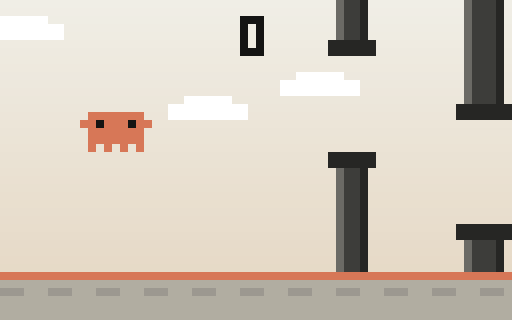
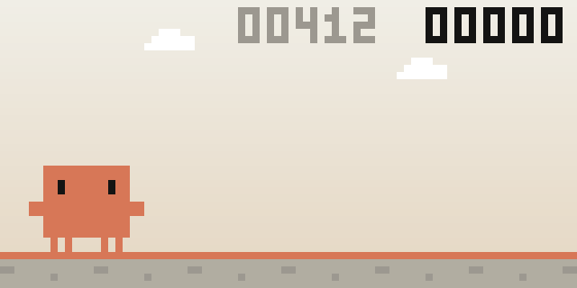
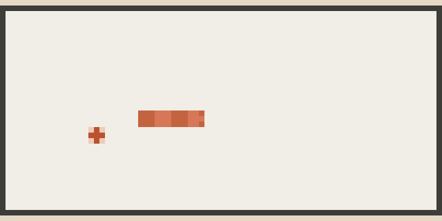
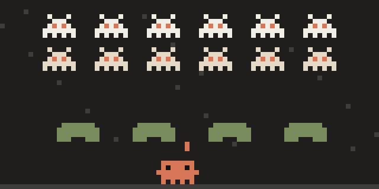
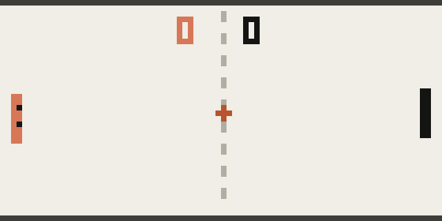
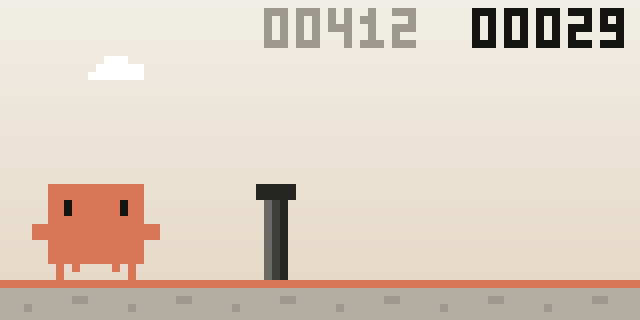
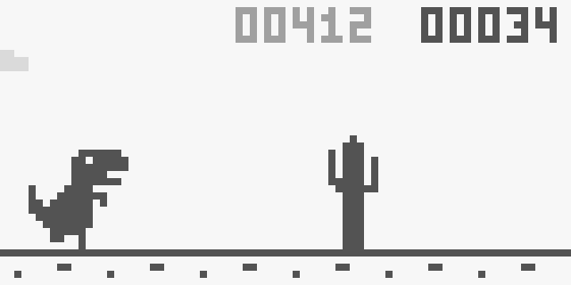
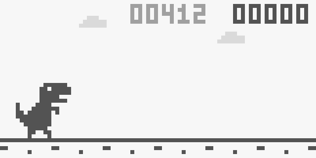

# Claude Code Arcade

Little games that live in a Claude Code pane, for the minutes while the agent works. They run in the terminal and in the desktop app's Code tab. One plugin, five games, all in Claude's colours.

<p align="center">
  
  
</p>
<p align="center">
  
  
  
</p>

| Game | Command | What it is |
|---|---|---|
| **Flappy Claude** | `/arcade flappy` | Flappy Bird with Clawd, the Claude Code mascot, flapping between pipes. Collect ✻ tokens. |
| **Dino** | `/arcade dino` | The Chrome "no internet" runner. Clawd hops pipes and ducks bugs in Claude's colours, or pick the original T-Rex with its cacti and pterodactyls. |
| **Clawd Snake** | `/arcade snake` | Snake with Clawd stretched out on a Claude-cream board, eating ✻ tokens. Every fifth token brings an Opus token worth 5, for a few seconds. |
| **Bug Invaders** | `/arcade invaders` | Space Invaders in Claude Code's dark theme. Clawd fires ✻ at a marching formation of bugs from behind olive test suites; an Opus ship crosses the top for a bonus. |
| **Clawd Pong** | `/arcade pong` | Pong up the model ladder: beat Haiku, then Sonnet, then Opus (who only gets faster). First to 5 takes a match; a lost match ends the run. |

`/arcade` on its own opens a menu of the games with your best scores.

## Install

At a Claude Code prompt:

```
/plugin install arcade --marketplace witkowsky/claude-code-arcade
```

Answer `y` to add the marketplace and pick a scope. Then start a new session, or run `/reload-plugins`.

Coming from the separate `flappy-claude` or `dino` plugins? Uninstall them (`/plugin uninstall flappy-claude`, `/plugin uninstall dino`); `arcade` has both. Best scores start over.

The games are mods: plugins built from function hooks. They need a Claude Code build that loads mods, both in the terminal and in the desktop Code tab.

## Play

- `/arcade` opens the menu (press a game's number, or click it); `/arcade <game>` opens a game straight away.
- **Click the game once** so it gets the keyboard, then:
  - Flappy Claude: **Space** / **↑** / click to flap.
  - Dino: **Space** / **↑** / click to jump, **↓** to duck.
  - Clawd Snake: **arrows** (or WASD / hjkl) to steer, or click to turn towards the pointer; **Space** pauses.
  - Bug Invaders: **←/→** (or A/D, H/L) to move, **Space** / **↑** to fire; or steer with the pointer and click to fire.
  - Clawd Pong: **↑/↓** (or W/S, K/J) to move, or steer with the pointer.
- After a crash, Space starts a new run. Your best score in each game is kept between sessions.
- **Esc** returns to the prompt, `games` goes back to the menu, and `close` closes the pane.

### Runner

`/arcade dino` runs Clawd by default. To get Chrome's grey T-Rex back, set `dinoTheme` to `chrome` (`/plugin configure arcade@claude-code-arcade`).

| `dinoTheme: claude` (default) | `dinoTheme: chrome` |
|---|---|
|  |  |

<p align="center"></p>

## How it works

- Each game is a `Client` surface module, so it runs on the drawing surface itself, with its own 30 fps clock and keyboard and mouse input. Nothing makes a round trip per frame.
- Each game's rules live in a pure engine (`arcade/games/*-engine.ts`, or inside the game for Dino), tested without any surface.
- Frames are drawn in pixels:
  - **Terminal:** each cell shows two pixels as a `▀` half block.
  - **Desktop:** text sits in taller line boxes there, so each cell is one background-coloured pixel. The frame is drawn in square pixels and folded into those taller cells, keeping thin details like Clawd's eyes.
- The hooks module registers `/arcade`, opens the menu and each game's pane, and keeps the best scores in the plugin store.

The plugin has tests:

```bash
claude plugin test arcade
```

## Credits

- Unofficial fan project, not affiliated with or endorsed by Anthropic. Clawd is the Claude Code mascot.
- Both runners follow the rules of Chrome's T-Rex runner: its speeds, gravity, gaps and pterodactyl timing come from Chromium's BSD-licensed source. The sprites were redrawn for this tiny pixel grid.

MIT licensed, see [LICENSE](LICENSE).
